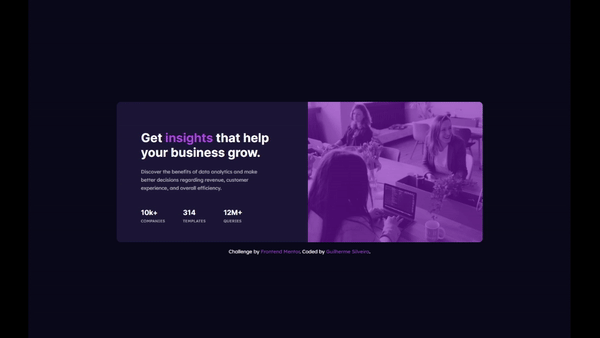

# Frontend Mentor - Stats preview card component solution

This is a solution to the [Stats preview card component challenge on Frontend Mentor](https://www.frontendmentor.io/challenges/stats-preview-card-component-8JqbgoU62). Frontend Mentor challenges help you improve your coding skills by building realistic projects. 

## Table of contents

- [Overview](#overview)
  - [The challenge](#the-challenge)
  - [Screenshot](#screenshot)
  - [Links](#links)
- [My process](#my-process)
  - [Built with](#built-with)
  - [What I learned](#what-i-learned)
  - [Continued development](#continued-development)

## Overview

### The challenge

Users should be able to:

- View the optimal layout depending on their device's screen size

### Screenshot

### Links

- Solution URL: [Front-End Mentor Solution](https://www.frontendmentor.io/solutions/stat-preview-card-using-html-css-and-flexbox-Po4rrr8Wy)
- Live Site URL: [On Github Pages](https://guisilveira.github.io/Stat-Preview-Card/)

## My process

### Built with

- Semantic HTML5 markup
- CSS
- Flexbox

### What I learned

I learned about the use of CSS variables, layouts with flexbox, the use of relative units to make responsible websites and media queries!

### Continued development

I want to keep improving my layouts focusing more on responsiveness!
